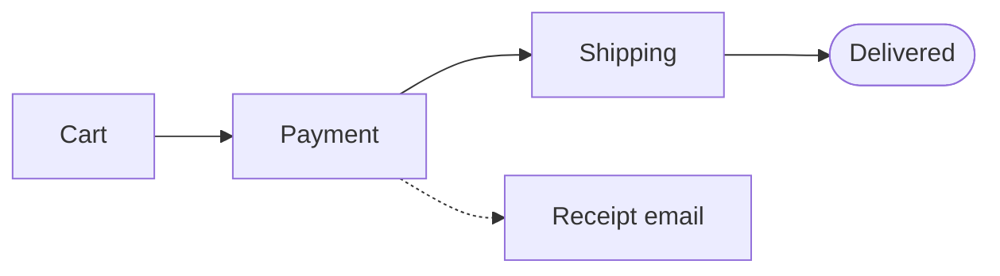
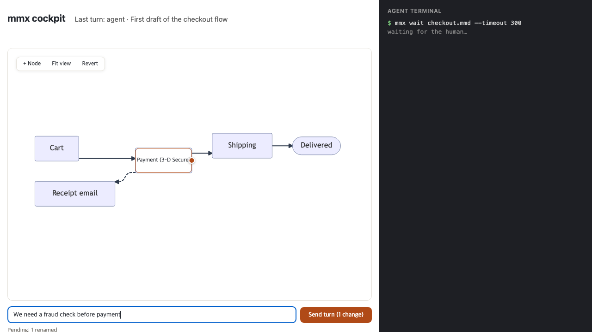
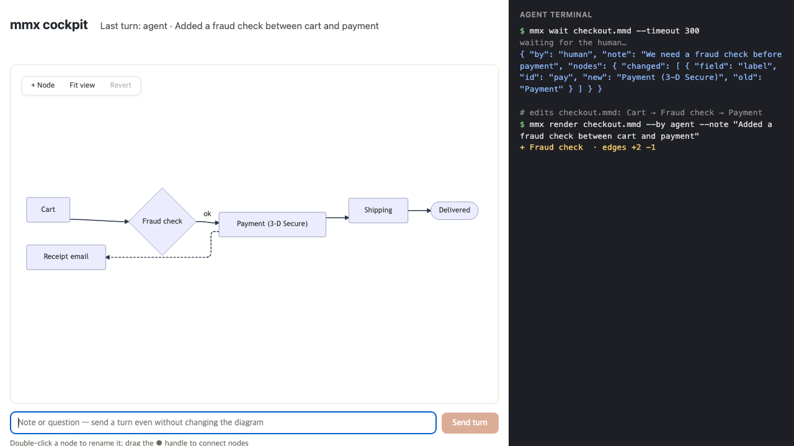

# mmx guide

mmx is a tool where a human edits an AI agent's Mermaid diagram directly on
the picture, and the agent knows exactly what the human changed.

- [Why](#why)
- [Quick start with Claude Code](#quick-start-with-claude-code)
- [Quick start with Codex (or any CLI agent)](#quick-start-with-codex-or-any-cli-agent)
- [How a turn looks](#how-a-turn-looks)
- [Commands](#commands)
- [What it is not](#what-it-is-not)
- [Known limitations](#known-limitations)
- [Compared to pasting Mermaid into chat](#compared-to-pasting-mermaid-into-chat)
- [Embedding](#embedding)

## Why

- Agents draw diagrams as text (Mermaid).
- Humans want to point at the picture and fix it, not describe the fix in words.
- After that, the agent needs to know precisely what changed, and who changed it.

mmx closes that loop. The agent writes a `.mmd` file. You open it in a local
cockpit (`mmx serve`) and edit the rendered diagram: double-click to rename,
drag to connect, delete, add, write a note, press Send. The agent, waiting in
`mmx wait`, receives your turn as a structured diff (labels, edge styles,
direction, subgraphs, text hunks, your note) and answers by editing the
diagram with a note of its own (`mmx render --by agent --note`), or with just a
note (`mmx note`). The cockpit shows the answer and the full turn history live.
A banner above the picture says what Send means and the reading order, and
shows the first line of the agent's latest note (by convention, what you must
do); it shrinks to one line after you send and expands when the agent answers.

Your edits patch the source text instead of regenerating it, so comments,
dashed arrows, subgraphs and styles survive. Both sides see the same picture:
one renderer (a pinned
[mermaid-rs-renderer](https://crates.io/crates/mermaid-rs-renderer)) produces
the SVG you edit and the layout the agent's diffs describe.

## Quick start with Claude Code

```bash
# 1. Install (prebuilt binary; or: cargo install mmx)
curl -LsSf https://github.com/Eastsidegunn/mmx/releases/latest/download/mmx-installer.sh | sh

# 2. Install the agent skill (~/.claude/skills/mmx)
mmx init

# 3. Optional: check the setup
mmx doctor
```

4. In a project, ask Claude:

   > Draw our checkout flow as `diagram.mmd` using mmx, then wait for my edits.

   Claude writes the file, runs
   `mmx render diagram.mmd --by agent --note "First draft"`, and blocks in
   `mmx wait diagram.mmd`.

5. In your own terminal:

   ```bash
   mmx serve diagram.mmd
   # http://127.0.0.1:52817   <- open this URL
   ```

6. Edit on the picture, add a note, press **Send**. `mmx wait` returns your
   turn to Claude; Claude edits the diagram and replies with a note, then
   waits again. The reply appears in the cockpit without a reload.

Optional: `mmx init --hooks diagram.mmd` (run inside the project) adds Claude
Code hooks, so every `.mmd` edit Claude makes is rendered automatically and
your direct file edits are injected at the start of each prompt. Restart the
session afterwards; hooks load at session start. Hooks need `python3`.

## Quick start with Codex (or any CLI agent)

mmx is model-agnostic: the protocol is files plus exit codes. It does not
call any model.

1. Install `mmx` as above.
2. `mmx init --codex` installs the skill for Codex as well
   (`~/.codex/skills/mmx`). `mmx init --codex --hooks diagram.mmd`, run inside
   the project, also installs Codex project hooks (review and trust them with
   `/hooks`); see [`adapters/codex/`](adapters/codex/README.md).
3. For any other agent, append [`adapters/AGENTS.md`](adapters/AGENTS.md) to
   your project's instructions file. It is the whole routine in two
   paragraphs.
4. Run `mmx serve diagram.mmd` and edit as above.

## Quick start with pi

[pi-mmx](adapters/pi/README.md) is a pi package: `pi install npm:pi-mmx`
(needs `mmx` 0.4+ on PATH). It gives the model `mmx_render` and `mmx_wait`,
validates `.mmd` edits made by pi's own edit/write tools, adds `/mmx open`
(starts `mmx serve` and opens the browser), and delivers each cockpit edit to
pi as the next turn, with a guard against runaway loops.

## Drawing a codebase

[`adapters/codemap/`](adapters/codemap/SKILL.md) is a skill for agents that
explain a code change as one picture the human corrects in the cockpit: the
topic, only the code involved (function level, one line each), how each unit
changes, and the decisions the human still has to make. Pictures with nothing
to decide stay with the agent. It includes a candidate selector
(`codemap.py`, standard library only), a small Rust indexer, the facts an
index should supply, and a worked example of an mmx commit in English and
Korean.

## How a turn looks

This is the scenario recorded in the demo GIF
([`examples/demo/`](examples/demo/) reproduces it). The agent drew:



In the cockpit, the human double-clicked `Payment`, renamed it to
`Payment (3-D Secure)`, wrote the note "We need a fraud check before payment"
and pressed Send.



The agent's `mmx wait checkout.mmd` printed this (one JSON line per turn;
pretty-printed and trimmed of empty sections here):

```json
{
  "mmx_diff_version": 2,
  "by": "human",
  "note": "We need a fraud check before payment",
  "nodes": {
    "added": [], "removed": [],
    "changed": [{"id": "pay", "field": "label", "old": "Payment", "new": "Payment (3-D Secure)"}]
  },
  "edges": {"added": [], "removed": [], "changed": []},
  "source_hunks": [{
    "old_start": 2, "old_lines": 3, "new_start": 2, "new_lines": 3,
    "lines": [
      "     %% dashed = not wired up yet",
      "-    cart[Cart] --> pay[Payment]",
      "+    cart[Cart] --> pay[\"Payment (3-D Secure)\"]",
      "     pay --> ship[Shipping]"
    ]
  }],
  "moved": [
    {"id": "cart", "dx": -61.4, "dy": 0.0},
    {"id": "done", "dx": 67.0, "dy": -0.2},
    {"id": "mail", "dx": -61.4, "dy": 5.6},
    {"id": "pay", "dx": 0.0, "dy": 1.3},
    {"id": "ship", "dx": 61.4, "dy": -0.2}
  ],
  "stats": {"mean_move_px": 50.6, "max_move_px": 67.0, "global_shift": {"dx": 61.4, "dy": 0.2}, "nodes": 5, "edges": 4, "crossings": 0},
  "warnings": [],
  "error": null
}
```

Three things to notice:

- Only the label changed in the source. The comment and the dashed arrow are
  untouched, and the editor quoted the new label because it contains
  parentheses.
- The note travels with the change, so the agent knows *why*.
- `moved`: renaming one label widened the node, and the renderer re-laid out
  the row, so every other node shifted by about 60 px. mmx reports this every
  turn; it does not prevent it (see [limitations](#known-limitations)).
  `stats.crossings` is the number of edge pairs whose lines cross in the
  picture, so the agent can tell when a reply made the picture harder to read.

The agent then inserted a decision node and answered:

```bash
# checkout.mmd now has: cart[Cart] --> fraud{Fraud check}
#                       fraud -->|ok| pay["Payment (3-D Secure)"]
mmx render checkout.mmd --by agent --note "Added a fraud check between cart and payment"
```

That turn's diff reports `nodes.added` `fraud` (`Fraud check`, `Diamond`),
`edges.added` `cart->fraud#0` and `fraud->pay#0` (label `ok`), and
`edges.removed` `cart->pay#0`. The cockpit picks it up live:



The full field reference is
[`skills/mmx/references/diff-schema.md`](skills/mmx/references/diff-schema.md).

## Commands

| Command | What it does |
| --- | --- |
| `mmx render <f.mmd> --by <who> [--note <text>] [--print-if-changed] [--layout-search <N>]` | Render the SVG and write this turn's diff and state. Unchanged bytes with no note are a no-op. `--layout-search N` first tries up to N (max 500) deterministic reorderings of a flowchart's top-level node declaration lines and edge lines (each kept with the comment directly above it), keeps the one with the fewest edge crossings if it parses to the same graph, writes it to the `.mmd` (the turn records it like any edit) and prints `layout: crossings <before> -> <after> (searched N, node and edge order)` on stderr. Pictures it cannot reorder safely print `layout: search skipped (<reason>)` and stay untouched: subgraphs, a non-flowchart, an id declared twice, a label spanning lines, or an `accTitle`/`accDescr`. With a numeric `linkStyle` or a `~~~` link only node declarations move (`node order only` in the stderr line), since mermaid.js counts `~~~` links in `linkStyle` indices. |
| `mmx serve <f.mmd> [--addr 127.0.0.1:0]` | Local browser cockpit: edit on the picture, send turns, see replies and the turn history live. Prints its URL. |
| `mmx wait <f.mmd> [--timeout 300]` | Block until the human has spoken last; print each unanswered human turn as one JSON line. |
| `mmx note <f.mmd> "<text>" [--by agent]` | Make a turn that carries a message, with or without diagram changes. |
| `mmx init [--codex] [--hooks <f.mmd>]` | Install the agent skill (Claude Code; `--codex` adds Codex); `--hooks` adds project hooks in the current directory. |
| `mmx doctor [<f.mmd>]` | Diagnose the installation, project hooks and, optionally, a diagram (validated without writing project files). |

### `serve` HTTP API

`mmx serve` binds to loopback by default. Every request must include a `Host`
header naming that loopback address and port (`127.0.0.1`, `localhost`, or
`[::1]`); an invalid `Host` or `Origin` is `403`. The fixed routes are:

| Request | Response |
| --- | --- |
| `GET /` (also `?lang=`) | Cockpit page (`text/html`) |
| `GET /editor.js` | Editor script |
| `GET /state` | `{source, svg, nodes, edges, seq, epoch, by, note}` |
| `POST /turn` with `Content-Type: application/json`, body `{source, note?, base_seq?}` | `200` with `{exit, noop?, state, diff, svg}`; parse errors are an exit-2 turn and still return `200` |
| `GET /history` | `{entries:[{at,by,note,summary}]}` |
| `GET /events` | SSE; each turn emits `{"seq", "epoch"}` |

Stale `base_seq` values and unrendered external edits return `409`; a wrong
content type returns `415`. Malformed requests, oversized headers, or oversized
bodies return `400` (the current limits are 16 KiB and 2 MiB). A deployment
proxy may translate an oversized request to `413`. For example:

```sh
curl -H 'Host: 127.0.0.1:8787' http://127.0.0.1:8787/state
```

Exit codes:

| Code | Meaning |
| --- | --- |
| `0` | Success, including a no-op. `doctor`: no problems found. |
| `2` | A fixable parse or encoding error (`render`, `note`). `diff.json` `error` has the message, line and column; fix the source and render again. |
| `1` | Anything else: I/O, usage, unsupported format, or a panic inside the renderer (`renderer failed on this input; the file was not changed`). `doctor`: problems found. |
| `3` | `mmx wait` only: timeout, nothing to report. |

A human turn can be an error turn too: Mermaid that `mmx serve` receives
from an API client (or a hand edit) is written to the `.mmd` as-is, so broken
text becomes an exit-2 turn that `mmx wait` reports with `error` set. The
agent fixes the syntax at that line and column and renders with `--by agent
--note` explaining the fix.

A `--note` is a message, so a non-empty note always makes a turn: if the
bytes were already rendered (by a hook or by `mmx serve`), it becomes a
note-only turn. Repeating the identical note on unchanged bytes is a no-op.

Per diagram `diagram.mmd`, mmx writes `diagram.svg`, `diagram.diff.json`,
`diagram.state.json`, `diagram.turns.jsonl` (the turn log) and, while serving,
`diagram.serve.json`. Agents read the diff (or the `mmx wait` output); the
other files are mmx's own memory. Do not edit them by hand. A
`diagram.serve.json` left behind after `mmx serve` was killed is harmless:
`wait` and `doctor` probe the URL it names instead of trusting the file.

## What it is not

- Not a Mermaid renderer and not a replacement for mermaid.js. Rendering is
  delegated to mermaid-rs-renderer.
- Not a general diagram editor. The cockpit edits what the agent drew; layout
  always belongs to the renderer.
- Not a token-saving trick. For a small diagram, re-reading the source is
  cheaper than reading a diff. The diff tells the agent *what changed and who
  changed it*, including things a re-read cannot show: which edge changed,
  what moved, and the human's note.
- Not a hosted service. Everything runs locally against files; there is no
  account and no connection to any external board or service.

## Known limitations

- **Hooks assume a POSIX shell.** `mmx init --hooks` writes commands in POSIX
  shell syntax that run `python3`; on Windows, run the agent from WSL or Git
  Bash, or skip hooks (every CLI command works without them).
- **Flowcharts are first-class.** Other diagram kinds get a partial node/edge
  diff plus complete `source_hunks` (every text change), and a warning says
  so. Editing on the picture targets flowcharts.
- **Sequence diagram message order is not modeled**; changes there appear in
  `source_hunks` only.
- **Layout can shift between turns. mmx measures it; it does not prevent it.**
  In our measurements, renaming one label moved four nodes (global shift
  33 px) and, in another diagram, moved a single node by up to 232 px; adding
  one edge moved nodes up to 65 px, deleting one up to 97 px. In the example
  above, one rename moved the four other nodes by 61 to 67 px. `moved` and `stats` report this every
  turn.
- **Pinned renderer.** mermaid-rs-renderer `=0.3.1`. Mermaid syntax coverage is
  that renderer's, not mermaid.js's. The lint follows mermaid.js where they
  differ: unquoted brackets in labels (`A[Charge (Stripe]`) and files without
  a diagram header are errors (exit 2) even if the renderer would accept them.
  Quote such labels: `A["Charge (Stripe"]`.
- **Some edge labels can be overlapped by nodes** (renderer layout).
- **A renderer panic is reported, not survived cleanly.** The CLI exits 1
  and `mmx serve` answers that turn with an error, both leaving the `.mmd`
  untouched; but the renderer's text measurer may be left degraded for the
  rest of that process, so restart `mmx serve` before the next turn.
- **An I/O failure after a successful render in `mmx serve`** (svg, diff and
  state written, then the `.mmd` could not be replaced) answers the turn with
  an error while those outputs already describe the submitted source; the
  next turn re-renders from the file and repairs them.
- **`mmx serve` is local-only and unauthenticated.** It binds to loopback by
  default; anyone who can reach the port can edit the diagram. See
  [SECURITY.md](SECURITY.md).
- **`by` records who ran the render**, not proof of who typed the change.
  While `mmx serve` is running, direct edits to the file are attributed to the
  agent; without it, `mmx wait` attributes them to the human.

## Compared to pasting Mermaid into chat

| | Mermaid in chat | mmx |
| --- | --- | --- |
| Same picture for both sides | Depends on each side's renderer | One pinned renderer; the agent's diffs describe the SVG you see |
| How the human asks for a change | Describes it in words | Edits the picture (rename, connect, delete, add) plus an optional note |
| What the agent receives | A message to interpret | An exact change record (nodes, edges, styles, direction, subgraphs, text hunks, movement) plus the note, per turn |
| History | Scrollback | A turn log (`.turns.jsonl`), shown in the cockpit |
| Comments, dashed arrows, styles | Whatever the agent rewrites | Kept: edits patch the source text |

## Embedding

The cockpit's editor is a dependency-free web component, `<mmx-editor>`, that
you can embed in your own page: feed it `{svg, nodes, edges, source}` from a
render and handle its `mmx-submit` event. A WASM build runs the full mmx turn
(lint, render, diff, state) in the browser. Both are release assets
(`mmx-editor.js`, `mmx_wasm.wasm` with its loader `mmx-wasm.js`). See
[`editor/README.md`](editor/README.md) for the component and
[`wasm/README.md`](wasm/README.md) for the wasm turn (API, JSON in/out, how
it differs from the CLI);
for a claude.ai artifact there is a ready shell in
[`adapters/claude-artifact/`](adapters/claude-artifact/README.md).
