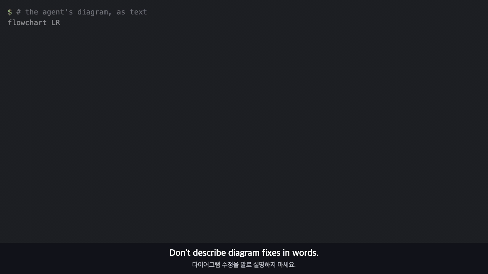

[English](README.md) · 한국어 · [简体中文](README.zh-CN.md) · [日本語](README.ja.md) · [Español](README.es.md)
> 이 문서는 영어 원문 [README.md](README.md)의 번역입니다 (기준: 8d9f4b0). 원문이 더 최신일 수 있습니다.

**AI agent? Read [AGENTS.md](AGENTS.md) first.**

# mmx

하나의 Mermaid 다이어그램에서 에이전트와 함께 그려 보세요. 내가 그림을 고치면
에이전트는 바뀐 부분을 정확히 읽고, 그림으로 답합니다.



[](https://github.com/Eastsidegunn/mmx/actions/workflows/ci.yml)
[](https://crates.io/crates/mmx)
[](LICENSE)

상자 이름을 바꾸고, 화살표를 새로 끌어 잇고, 메모를 남긴 뒤 보내기를 누르세요.
에이전트는 해석해야 할 긴 설명 대신 정확한 변경 사항(어떤 노드, 어떤 연결, 남긴
메모)을 받고, 같은 다이어그램을 고쳐 답합니다. 내가 쓴 주석, 점선 화살표, 스타일은
그대로 남고, 나와 에이전트가 같은 그림을 봅니다.

## 설치

```bash
curl -LsSf https://github.com/Eastsidegunn/mmx/releases/latest/download/mmx-installer.sh | sh   # or: cargo install mmx
mmx init   # Claude Code skill; add --codex for Codex
mmx --version   # serve, wait, note and diff v2 need 0.4.0 or newer
```

## 사용해 보기

1. 에이전트에게 요청하세요: *"우리 결제 흐름을 mmx로 `diagram.mmd`에 그리고, 내가 고칠 때까지 기다려 줘."*
2. `mmx serve diagram.mmd`를 실행하고 출력된 URL을 여세요.
3. 그림을 직접 고친 뒤 보내기를 누르세요. 에이전트가 다이어그램으로 답합니다.

Claude Code, Codex는 물론 CLI를 실행할 수 있는 에이전트라면 무엇이든 함께 쓸 수
있습니다. 모두 로컬에서 실행되며, 계정이 필요 없고 외부 서버에 올라가는 것도 없습니다.

## 더 보기

- [가이드](GUIDE.md) (English): 턴이 동작하는 방식, 명령어, 제약 사항
- [자세한 설치 방법](INSTALL.md) (English)
- [편집기 임베드하기](editor/README.md) (English)
- [변경 이력](CHANGELOG.md) (English) · [기여하기](CONTRIBUTING.md) (English) · [보안](SECURITY.md) (English) · [라이선스 (MIT)](LICENSE) (English)
