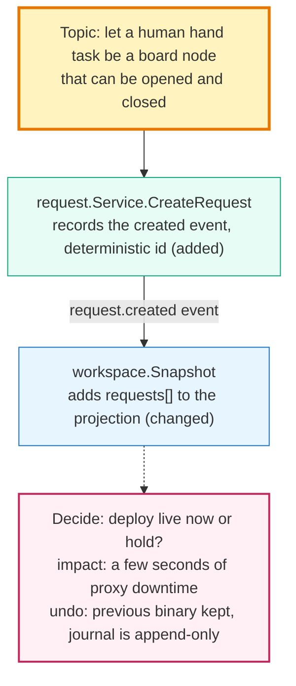

# A code conversation as one picture

A codemap is not a dependency graph. It is one conversation the agent wants
to have with the human about code, drawn as four layers in a single
flowchart. The dependency graph is only raw material for the second layer.

This skill extends the repository's `mmx` skill: follow its render, wait,
note, error-repair, and one-renderer rules. Edit only `.mmd`; show only the
SVG that `mmx` produced; never use `subgraph` (the pinned renderer makes
subgraphs very wide).

## The four layers

| Layer | What it is | How it is drawn | Limits |
| --- | --- | --- | --- |
| 1. Topic | One sentence, from the human's point of view, saying what this picture is about | One node `T`, declared first, `class T topic` | Exactly one, ≤ 40 characters |
| 2. Code involved | Only the code that takes part in the topic, at function, type, or module level (not files). Each node carries one line saying what it does | Label `pkg.Func<br/>what it does`; `class … add` / `change` / `remove` by layer 3; nodes that are only context get `class … faded` | ≤ 12 nodes; ≤ 3 faded |
| 3. How it changes | For each code node: added, changed, moved, or removed, plus a before→after line | Suffix `(added)`, `(changed)`, `(moved)`, `(removed)` on the label; before→after on the edge label or as the label's last line; unchanged nodes say `(as is)`; planned work says `(to change)` | — |
| 4. Decisions | Only what the human must decide for the work to finish: the question, the options, the impact, and whether it can be undone | Rectangle `D1["Decide: …"]`, `class D1 decide`; dashed edges from the affected code nodes **to** the decision (`code -.-> D1`) | ≤ 3 nodes, ≤ 4 label lines |

**The first screen tells the human what to do.** The topic node's first
lines (before the topic sentence itself, separated by `—`) always say, in the
reader's language: (1) *what you must do* — `없음 (확인용, 닫아도 됨)`, `확인만`,
or `결정 N개`; (2) *reading order* — yellow box → colored boxes (green added,
blue changed, gray border context) → pink decisions / gray finished
decisions; (3) *what Send means* — fix wrong or missing links on the picture
and press Send, and the agent answers next turn. With zero open decisions,
say explicitly that the picture is for checking and may be closed. The turn
note repeats line (1) and (3). A human who opens the cockpit and asks "so
what am I supposed to do?" means this block was missing.

Edges say why two nodes are connected: the data, event, or call that flows
(`-->|"request.created event"|`). Do not write reference counts.

Write every label — topic, roles, before→after, edge labels, decisions —
in the reader's language, Korean unless the human asked otherwise;
identifiers (`serve.apply_turn`, `GET /history`) stay exactly as in the
code. `example/mmx-self/turn-log-change.ko.mmd` is the Korean form of the
worked example.

Use `flowchart LR` by default (the human reads data flow left to right;
`TD` is an option for tall monitors). Declare nodes in reading order: topic,
code in flow order, decisions. The pinned renderer does not place nodes by
declaration order alone, so after rendering count edge crossings (pairs of
edge paths that intersect in the SVG); if there are more than three, try
other declaration orders of the code nodes and keep the best — a few
hundred renders take about a minute and cost no tokens. Labels are 2–4 lines using `<br/>`; replace `"` with `'`,
drop newlines, leave `&`, `<`, `>` raw (the renderer does not decode
entities). Whole picture: ≤ 16 nodes and ≤ 20 edges. If the topic needs
more, split the topic into two pictures, never shrink the picture with
summaries.



## Procedure, every turn

1. **Write the topic first.** One to three lines, from the human's side:
   what they can now do, and what they are being asked to judge in this
   picture (`Topic: your cockpit edit now wakes me, I can answer with a
   note, every window shows the whole history — check that this loop is
   drawn right`), not `Topic: close the loop`. No topic, no picture.
2. **Select the code.** Sources: the current `git diff` (a change in progress
   or just made), or a host index (`graph.json`, see below) queried with
   `codemap.py --strategy neighborhood|path|impact|changeset`. Keep a unit
   only if the topic sentence's verbs and nouns touch it. Go down to
   functions and types, not whole files. For every unit you keep, look one
   hop at its callers (`grep -n 'name('`) and keep the caller that carries
   data across a process or file boundary (a poller, a reader, an HTTP
   handler); without it the human cannot see how one side reaches the other.
   Name each node by the symbol that actually changed (`run_render_bytes`,
   not a shorter name you invented).
3. **Say what each unit does**, one line. Source order: its doc comment's
   first sentence, then the signature, then its body. When the source is in
   the repository, read it and write a verified line; `?` is only for a
   line you could not verify (source missing or generated), and the note
   says why.
4. **Mark how each unit changes.** Read add/remove/change from the hunks. A
   unit that existed elsewhere before is `(moved)` or `(moved+changed)`,
   not `(added)`; check `git diff -M` and the old file before calling
   anything new.
   Write before→after as a sentence a person reads (`projects gates only →
   projects gates and requests`).
5. **Verify every edge before rendering.** For each edge, find the line
   where the data, event, or call actually crosses, and record it as a
   Mermaid comment next to the edge, naming the revision the line belongs
   to: `%% run_wait -> default_job: src/turnlog.rs:252@3af221a`. An edge you
   cannot point to a line for is not drawn. The same rule applies to edges
   the human adds.
6. **Keep only real decisions.** Make a decision node only when (a) two or
   more sound implementations exist and one must be picked, (b) there is an
   external effect, cost, or something hard to undo, or (c) the human's
   rules or taste change the outcome. Label: question / options / impact /
   undo. One option is not a decision; it is layer 3. Decisions already made
   by agents or operators are not drawn.
7. **Render with a note** that states the topic and one ask. Render at most
   twice per turn (once, plus one fix if the exit is 2); do the reading
   before, not between, renders. Read only the diff hunks and the bodies of
   the units you draw (`sed -n` on line ranges), never whole files outside
   them, and end the note with the list of files and line ranges you read:
   `mmx render map.mmd --by agent --note "<topic>. Please answer D1 by
   editing its text, or fix wrong links on the picture."` Without a decision
   node, ask the human to fix wrong or missing code.
8. **Send only pictures that ask something.** A picture with zero open
   decisions is for your own review (or a record in the turn log); do not
   open a cockpit for it or ask the human to look. A human shown such a
   picture rightly asks what you wanted to talk about. If the topic has
   nothing to decide, say so in a note and move on.
9. **Read the human's turn** (diff v2 from `mmx wait`):

   | Human edit | Meaning and response |
   | --- | --- |
   | Label of a `D*` node changed | Their answer (an option or free text). Next turn: update layer 3, set `class D1 decided` and relabel it `Decided (turn N): <the rule exactly as the human stated it>`, keeping the question and the chosen option readable — a reader of the final picture must still see what was decided; never delete it. Record it in memory. |
   | Code node removed | "Not part of this topic." Add to `omitted`; do not draw it again for this topic. |
   | Code node label changed | A correction of what it does. Store in `aliases`; if it disagrees with the source, ask in the note with file:line. If it replaces a `?` line, drop the `?`. |
   | Edge added or removed | A claim about a connection. Verify in source; keep it if true, otherwise answer with evidence. |
   | Note only | A question. Answer with `mmx note` or a redrawn picture. |
   | `moved` entries | Layout effects; ignore. |

10. Repeat from step 1 with the next topic. A new topic is a new picture.

## Memory

`.mmx/codemap.json` holds only interaction memory, never source text:

```json
{
  "aliases": {"ws_snapshot": "workspace projection"},
  "omitted": ["archtest"],
  "decisions": {"D1": {"question": "deploy live now or hold?", "answer": "now", "status": "decided", "turn": 3}},
  "last": {"topic": "…", "nodes": ["svc_create", "ws_snapshot"]}
}
```

## Facts the host should supply (index contract, `graph.v2`)

The four layers need facts that are cheaper to compute outside the agent.
Any host index may provide them; `example/index_rust.py` provides the subset
it can for a Rust crate. Missing fields are filled by the agent and marked
`?` (roles) or asked about in the note.

```json
{"version": 2,
 "nodes": [{"id": "ws_snapshot", "kind": "function", "symbol": "workspace.Snapshot", "path": "src/workspace.rs", "span": [210, 290],
            "layer": "projection", "role": "adds requests[] to the projection", "role_source": "doc", "tested_by": ["src/workspace_test.rs"]}],
 "edges": [{"from": "req_replay", "to": "ws_snapshot", "kind": "data", "symbols": ["Ref"], "why": "restored state enters the projection", "span": [233, 233]}],
 "changeset": [{"node": "ws_snapshot", "op": "change", "before": "projects gates only", "after": "projects gates and requests", "hunks": ["@@ -210,4 +210,20 @@"], "commit": "abc1234"}],
 "decisions": [{"id": "D1", "question": "deploy live now or hold?", "options": ["now", "hold"], "impact": "seconds of proxy downtime", "reversible": "binary yes; journal append-only", "status": "open", "decided_by": "human", "board": "gate:…"}]}
```

- `nodes[].kind`: `function`, `type`, `module`, `file`, `external`.
  `layer`: `kernel`, `projection`, `adapter`, `cockpit`, `test`.
  `role_source`: `doc`, `signature`, `agent`, `human`.
- `edges[].kind`: `call`, `import`, `data`, `event`, `test`; `symbols` are the
  names that cross the edge; `why` is a short phrase.
- `changeset[].op`: `add`, `remove`, `change`, `move`; `planned: true` for
  work not done yet.
- `decisions[].decided_by`: `human` (draw it) or `operator` (do not draw it).
- Version 1 files (`nodes[].refs`, `edges[].count`, no `version`) still load;
  they only support step 2.

`codemap.py` selects candidates for layer 2 (`neighborhood`, `path`,
`impact`, `changeset`) and writes a flowchart plus a JSON report. Treat its
output as the candidate list, not the picture: pass `--max-nodes 12
--max-edges 20`, then write the four-layer picture yourself from those
candidates. Use the topic to select, not an algorithm to shrink.

```bash
python3 adapters/codemap/example/index_rust.py src > .mmx/graph.json
python3 adapters/codemap/codemap.py .mmx/graph.json --focus src_serve_rs --strategy neighborhood --hops 1 --max-nodes 12 --max-edges 20 --out .mmx/candidates.mmd
```

## Worked example

`example/mmx-self/turn-log-change.mmd` reconstructs a real mmx commit
(`3af221a`, "close the conversation loop — wait, note, turn log") as one
picture: the topic, the code units with what they do and how they changed,
and the decision the human had to make. Read it before drawing your first
picture.
